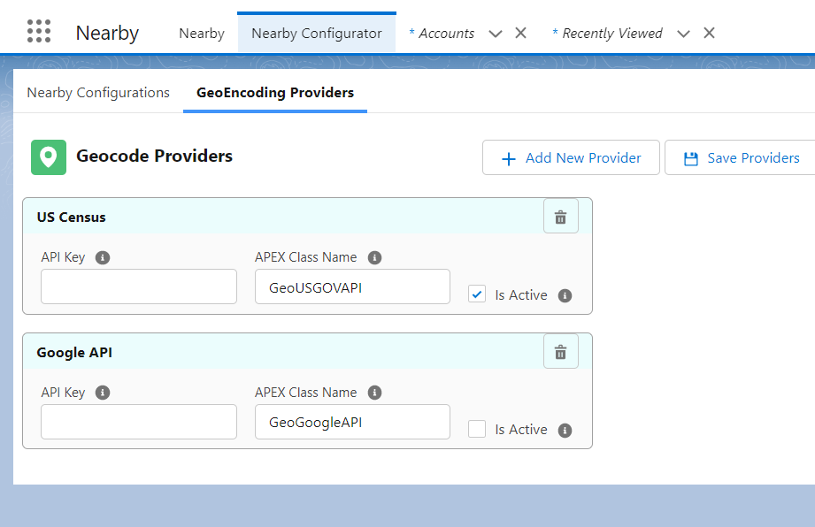
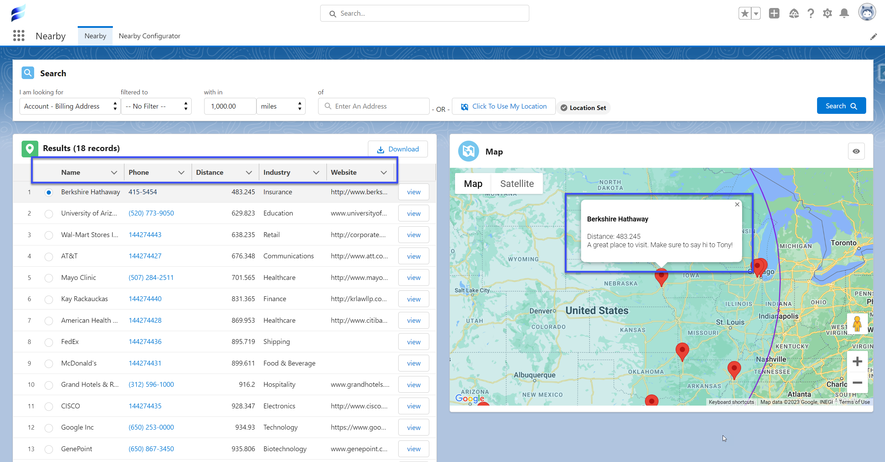

[Back To Home](index.md)

# Features

1. [Geocoding Freedom](#geocoding-freedom)
1. [Five Minute Functionality](#five-minute-functionality)
1. [Custom Geocoding Field Support](#custom-geocoding-field-support)
1. [Searching and Filters Made Easy](#searching-and-filters-made-easy)
1. [Export Helpful Map Data](#export-helpful-map-data)
1. [Fully Customizable](#fully-customizable)

## Geocoding Freedom

Interact with any Geocode API you desire using Custom Providers Setups and with your own APEX.

## Five Minute Functionality

Works with standard data integrations in seconds

## Custom Geocoding Field Support

Can be setup for custom object using Apex to import geocode data from provider

## Searching and Filters Made Easy

Easily set up multiple configurations for address fields and filters for easy targeting of addresses

## Export Helpful Map Data

Export list of data for customer visits or to plan a sales route

## Fully Customizable

Customize insight by choosing the data you see on the map and the search list.

