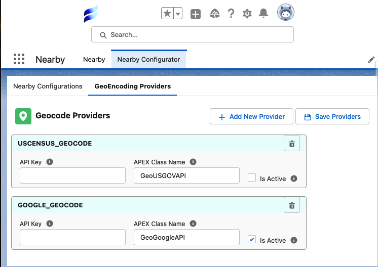

[Back To Home](index.md)

# Geo encoding Providers and configuration

## Google API Key provider

Using a google API key is recommended to give your users the optimum experience for searching from arbitrary addresses, postal codes, cities and more.
The base provider requires a full non typoed address to get results - google provides a more "fuzzy" matching experience.

Google provides (as of 1/1/2023) 200 dollars per month credit to a google cloud account. This entails that your organization can use up to 20,000 api calls a month and not be charged.

### Obtaining a Google API Key

[Getting Started with Google Maps Platform](https://developers.google.com/maps/gmp-get-started)

[Get Google Maps API Key](https://developers.google.com/maps/documentation/geocoding/get-api-key)

#### Using Google API Key

Paste API key into the Google box in the Nearby Configuration screen

