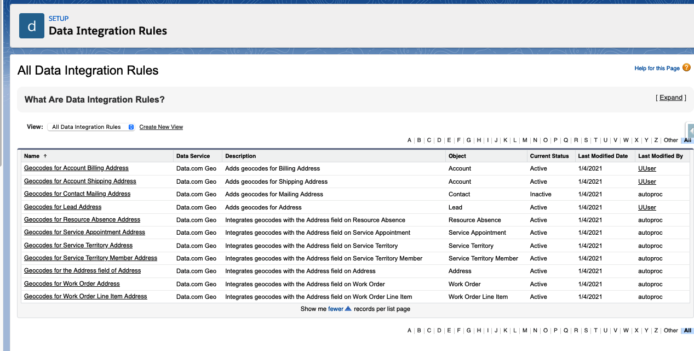
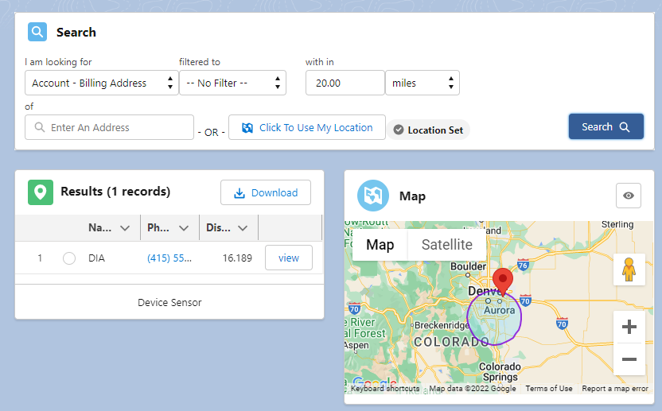
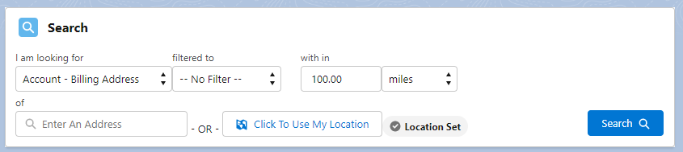
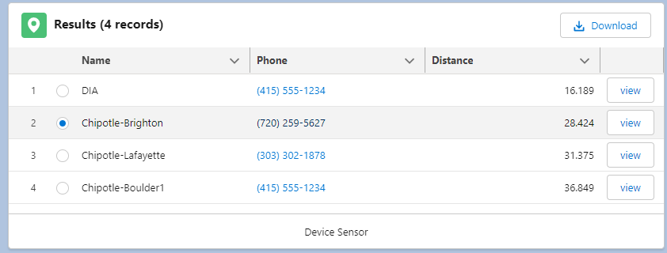
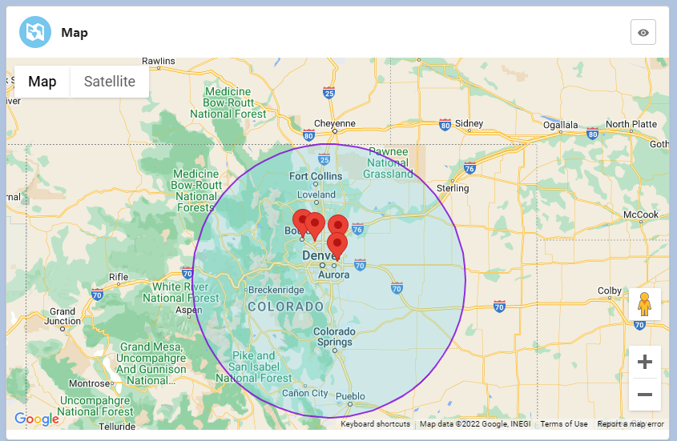
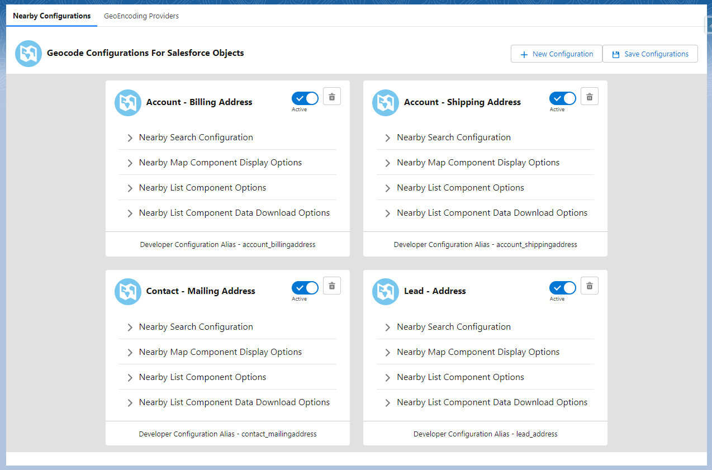

# Quick Start

### Activate 'Data Integration Rules'

- From Setup go to Data Integration Rules
- Enable the following
    - Geocodes for Account Billing Address
    - Geocodes for Account Shipping Address
    - Geocodes for Contact Mailing Address
    - Geocodes for Lead Address

### Adding Components to a Lightning Page

NearBy has multiple components that can be used to facilitate showing users what they need to see.

#### Entity Locator 

This component has all the other components in one; Nearby Search, Nearby List, Nearby Map. It is the best component to use when getting started. Just drop it and go.

For more information on then individual pieces please see below.

#### Nearby Search Component

This component will let you reference various COnfigurations you have set up to search for addresses with in the chosen location.

**I am looking for** -  Her eyou will choose a configuration build by an admin to set the addresses you want to find.

**Filtered to** - This will allow you to reference filters that are part of that configuration.

**With in** -  Set a number and a distance unit for your search radius.

**Of** -  Enter an Address or use your current location. Note here if you are using the out of box US Census Geo Code data the address will need to be a full proper address, Iit cannot be address parts.

i.e. *111 N. Green St Wiltlen, CA 81919*. not *111 Green Street*

**Search** - This Button will initiate your search based on the above criteria. 

#### Nearby List Component

This component will display a list of the records found based on the criteria set in teh search component. 

Clicking the Download button will download the list of records returned in an excel document.

Clicking on the radio button on the left will center your Nearby Map component on that address.

Clicking View on the right will navigate you to the record in a new tab.

The columns can be set in the configuration you choose in the I am looking for section of the search component. 

#### Nearby Map Component

The Nearby Map Component will show the Items from the Nearby List based on the search criteria in the Nearby Search. When the component loads it will show a blue circle for the radius of your search.

It can be moved by clicking and dragging and can also be recenterd by clicking on an item on the Nearby List component.

You can also switch between Map and Satellite by clicking the buttons on the top left.

#### Geo Configurator Component

This component can be used to access NearBy Configuration wherever you add it. This can be helpful when you need to quickly add a column or change the mapped address fields.

NOTE: Not everyone should have access to the Nearby Configuration. Only Admins and folks who are familiar with how geocode mapping works. You can conditionally hide component on pages and lightning apps. Please use the article here to understand how:

https://help.salesforce.com/s/articleView?id=sf.lightning_page_components_visibility.htm&type=5